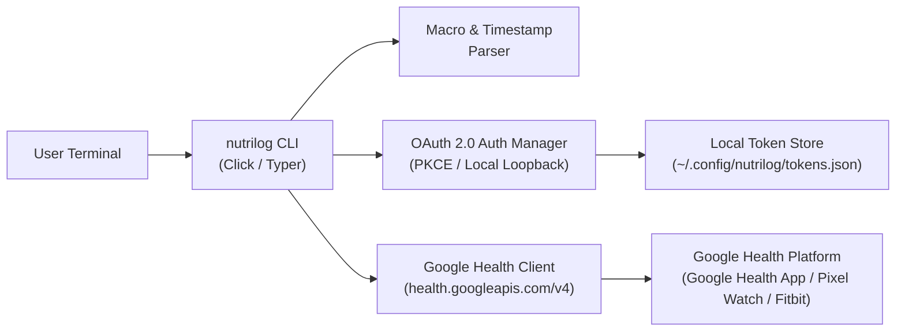

# Nutrilog: End-to-End Implementation & Publishing Plan

A standalone, privacy-first CLI tool for logging meals, macronutrients, and calories directly to the **Google Health API (`health.googleapis.com/v4`)** from any terminal, usable with any standard `@gmail.com` or Google Workspace account.

---

## 1. Executive Architecture Overview



### Core Goals:
1. **Zero-Friction Logging:** Log any meal (cafe, restaurant, home-cooked) in $<2$ seconds via shorthand or natural flags.
2. **True Cloud Sync:** Syncs natively with the user's Pixel Watch, Fitbit, and Google Health mobile app.
3. **Works Anywhere:** Completely decoupled from internal corporate tooling (`google3`), packaged as a clean open-source Python tool (`pip` / `pipx`).
4. **Google Cloud Publishing Path:** Clear roadmap from personal developer mode ("Testing" state) to verified published OAuth app.

---

## 2. Google Cloud & OAuth 2.0 Setup (Prerequisites & Publishing)

Because health and nutrition data is categorized under Google's **Sensitive / Restricted Scopes**, Google applies specific verification tiers for OAuth applications.

### Phase 2.1: Google Cloud Project Creation
1. Create a project in [Google Cloud Console](https://console.cloud.google.com): `nutrilog-cli-app`.
2. Enable the **Google Health API**:
   * Navigate to *APIs & Services > Library*.
   * Search for **Google Health API** and click **Enable**.

### Phase 2.2: OAuth 2.0 Consent Screen Configuration
1. **User Type:** Select **External** (allows any `@gmail.com` account to sign in).
2. **App Information:**
   * App Name: `Nutrilog CLI`
   * User support email: Developer email.
   * App logo (optional, 120x120px).
3. **Scopes Requested:**
   * `https://www.googleapis.com/auth/health.nutrition.writeonly` (Required: write meals, calories, macros)
   * `https://www.googleapis.com/auth/health.nutrition.readonly` (Optional: view meal history)
4. **OAuth Client Credentials:**
   * Create Credentials > **OAuth Client ID**.
   * Application Type: **Desktop App**.
   * Name: `Nutrilog Desktop Client`.
   * Download `client_secrets.json`.

---

### Phase 2.3: The Verification & Publishing Roadmap

Google enforces specific trust states for OAuth applications accessing Health APIs:

```
[ State A: Local Developer Mode ]
       │  (Self-use & Test Users)
       ▼
[ State B: Pre-Launch / Test Track ] ──► Up to 100 explicit test Gmail accounts
       │                                  (Instant access, zero review required)
       ▼
[ State C: Public Production App ]  ──► Cloud Verification + CASA Assessment
                                          (Publicly usable by anyone on the internet)
```

| Deployment Tier | Who Can Sign In | Requirements | Best For |
| :--- | :--- | :--- | :--- |
| **Tier 1: Developer / Testing** *(Fastest)* | You + up to 100 explicitly added test Gmail accounts. | • Add test emails in GCP Console.<br/>• Users see a one-time *"Google hasn't verified this app"* warning screen. | **Immediate personal use, pair programming, beta testers.** |
| **Tier 2: Publicly Verified App** | Any Google account worldwide without warning dialogs. | • Public domain with verified ownership.<br/>• Privacy Policy & Terms of Service URLs.<br/>• YouTube demo video showing OAuth flow.<br/>• Cloud Application Security Assessment (CASA Tier 2). | **Public PyPI release for widespread distribution.** |

> [!TIP]
> **Recommended Strategy:** Start in **Tier 1 (Testing Mode)** with your personal Gmail added to the Test Users list. This allows full, unrestricted API access within 5 minutes while working towards Tier 2 verification for public PyPI distribution.

---

## 3. Google Health API (v4) Technical Specification

### 3.1 Endpoint Schema
* **URL:** `POST https://health.googleapis.com/v4/users/me/dataTypes/nutrition-log/dataPoints`
* **HTTP Method:** `POST`
* **Headers:**
  ```http
  Authorization: Bearer <ACCESS_TOKEN>
  Content-Type: application/json
  ```

### 3.2 Canonical JSON Request Payload
```json
{
  "nutritionLog": {
    "foodDisplayName": "Tofu & Edamame Soba Bowl",
    "mealType": "LUNCH",
    "interval": {
      "startTime": "2026-08-17T12:30:00Z",
      "endTime": "2026-08-17T13:00:00Z"
    },
    "energy": {
      "kcal": 580
    },
    "totalCarbohydrate": {
      "grams": 54.0
    },
    "totalFat": {
      "grams": 18.0
    },
    "nutrients": [
      {
        "nutrient": "PROTEIN",
        "quantity": {
          "grams": 38.5
        }
      },
      {
        "nutrient": "FIBER",
        "quantity": {
          "grams": 9.0
        }
      },
      {
        "nutrient": "SODIUM",
        "quantity": {
          "grams": 0.650
        }
      }
    ],
    "serving": {
      "amount": 1.0,
      "unit": "bowl"
    }
  }
}
```

### 3.3 Supported Nutrients & Enums
* **Meal Types:** `MEAL_TYPE_UNSPECIFIED`, `BREAKFAST`, `LUNCH`, `DINNER`, `SNACK`.
* **Nutrient Enums:** `PROTEIN`, `TOTAL_FAT`, `TOTAL_CARBOHYDRATE`, `FIBER`, `SUGAR`, `SODIUM`, `POTASSIUM`, `CALCIUM`, `IRON`, `SATURATED_FAT`, `CHOLESTEROL`.

---

## 4. Local CLI Implementation Architecture

```
~/Sandbox/nutrilog/
├── pyproject.toml              # Build & dependency metadata (Hatchling / Flit)
├── README.md                   # Quickstart, setup guide & documentation
├── nutrilog/
│   ├── __init__.py
│   ├── cli.py                  # CLI command dispatch & argument parsing (Typer/Click)
│   ├── auth.py                 # OAuth 2.0 PKCE local loopback flow & token refresh
│   ├── client.py               # Google Health API v4 HTTP client
│   ├── parser.py               # Shorthand & natural language macro parser
│   ├── storage.py              # Local secure token & cache management
│   └── models.py               # Pydantic data schemas for meals & nutrients
└── tests/
    ├── test_parser.py          # Unit tests for shorthand macro syntax
    ├── test_client.py          # Mocked HTTP tests for API payloads
    └── test_auth.py            # Token refresh & keyring tests
```

---

## 5. User Experience & CLI Command Design

### 5.1 Initial Setup (`nutrilog auth`)
```bash
# Authenticate with Google OAuth via browser loopback
nutrilog auth login

# Check authentication status & token expiry
nutrilog auth status

# Discard tokens & sign out
nutrilog auth logout
```

### 5.2 Fast Shorthand Logging (`nutrilog log` / `nutrilog quick`)
```bash
# 1. Shorthand notation (macros + name)
nutrilog "38p 18f 54c 580k Tofu Edamame Soba Bowl"

# 2. Flag-based explicit logging
nutrilog log "Grilled Barramundi & Veggies" \
  --protein 36 \
  --calories 480 \
  --fat 14 \
  --carbs 12 \
  --meal lunch

# 3. Quick calorie/protein top-up
nutrilog quick --protein 25 --calories 180 --name "Post-workout Protein Shake"
```

### 5.3 Meal History & Daily Targets (`nutrilog today` / `nutrilog history`)
```bash
# View today's total logged macros vs daily targets
nutrilog today

# Output:
# ━━━━━━━━━━━━━━━━ Today's Nutrition Summary (Mon, Aug 17) ━━━━━━━━━━━━━━━━
# Meals Logged: 2
# • 12:30 PM [Lunch]  Tofu & Edamame Bowl  38.5g P | 580 kcal | 54g C | 18g F
# • 04:00 PM [Snack]  Protein Shake        25.0g P | 180 kcal |  4g C |  2g F
# ──────────────────────────────────────────────────────────────────────────
# Daily Total:        63.5g / 120g Protein (53%) | 760 / 2,000 kcal (38%)
# Remaining:          56.5g Protein | 1,240 kcal
```

---

## 6. Detailed Step-by-Step Implementation Roadmap

### Step 1: GCP Project & OAuth Setup
* [ ] Create GCP Project: `nutrilog-prod`.
* [ ] Enable `Google Health API` in API Library.
* [ ] Configure OAuth Consent Screen (External, Test mode).
* [ ] Add personal Gmail to **Test Users**.
* [ ] Download Desktop OAuth Client JSON to `~/.config/nutrilog/credentials.json`.

### Step 2: Core Python Engine (`nutrilog/`)
* [ ] **`auth.py`**: Implement `InstalledAppFlow.run_local_server(port=0)` with automatic token refresh via `google.auth.transport.requests.Request`.
* [ ] **`storage.py`**: Secure token persistence in `~/.config/nutrilog/tokens.json` with strict `0600` permissions.
* [ ] **`models.py`**: Define `MealLog`, `NutrientEntry`, and `MacroSummary` dataclasses.
* [ ] **`parser.py`**: Implement regex parser for shorthand macro strings (e.g. `35p 600k 20f 40c`).
* [ ] **`client.py`**: Build resilient `GoogleHealthClient` handling retry logic, ISO timestamp formatting, and payload serialization.

### Step 3: CLI Interface & Rich Terminal UI
* [ ] Build Typer CLI commands in `cli.py` (`login`, `log`, `today`, `history`, `config`).
* [ ] Format terminal tables and progress bars using `rich`.

### Step 4: Verification & Integration Testing
* [ ] Run end-to-end integration test: log a test meal from terminal.
* [ ] Open **Google Health App on phone / Pixel Watch / Fitbit** and confirm live synchronization.
* [ ] Verify accurate calorie rollup and macronutrient calculation on mobile dashboard.

### Step 5: Packaging & Open-Source Distribution
* [ ] Configure `pyproject.toml` with entry point `nutrilog = "nutrilog.cli:app"`.
* [ ] Author comprehensive `README.md` with GCP setup walkthrough and visual examples.
* [ ] Publish package to PyPI (`pip install nutrilog`).
