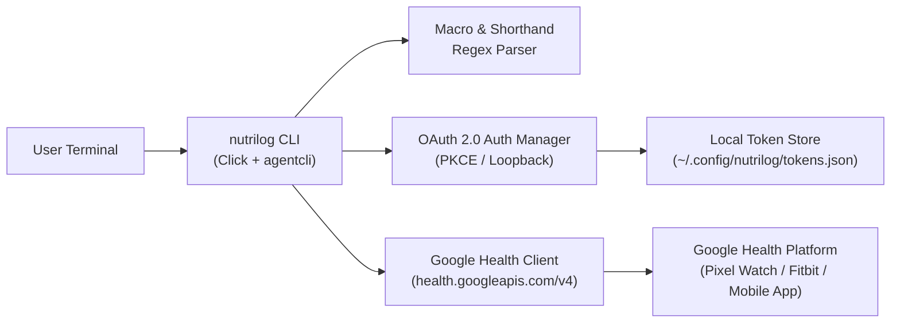

# Nutrilog

[](https://www.python.org/downloads/)
[](https://opensource.org/licenses/MIT)
[](https://click.palletsprojects.com/)
[](https://github.com/astral-sh/uv)

A fast, privacy-first CLI tool for logging meals, macronutrients, and calories directly to the **Google Health API (`health.googleapis.com/v4`)** from any terminal. Syncs live with your **Google Health app**, **Fitbit**, and **Pixel Watch**.

---

```
                           Meal History (Tue, Aug 18)
┏━━━━━━━━━━┳━━━━━━━━━━┳━━━━━━━━━━━━━━━━━━━━━━━━┳━━━━━━━━━┳━━━━━━━━━━┳━━━━━━━┳━━━━━━━┳━━━━━━━━━┓
┃ Time /   ┃ Meal     ┃                        ┃         ┃          ┃       ┃       ┃ Point   ┃
┃ Date     ┃ Type     ┃ Food                   ┃ Protein ┃ Calories ┃ Carbs ┃   Fat ┃ ID      ┃
┡━━━━━━━━━━╇━━━━━━━━━━╇━━━━━━━━━━━━━━━━━━━━━━━━╇━━━━━━━━━╇━━━━━━━━━━╇━━━━━━━╇━━━━━━━╇━━━━━━━━━┩
│ 12:30 PM │ Lunch    │ Tofu Edamame Soba Bowl │   38.5g │ 580 kcal │ 54.0g │ 18.0g │ 519101… │
│ 04:00 PM │ Snack    │ Protein Shake          │   25.0g │ 180 kcal │  4.0g │  2.0g │ 719082… │
└──────────┴──────────┴────────────────────────┴─────────┴──────────┴───────┴───────┴─────────┘
╭──────────────────────────────────────────────────────────────────────────────╮
│ Total Consumed (2 meals): 63.5g Protein | 760 kcal | 58.0g Carbs | 20.0g Fat │
╰──────────────────────────────────────────────────────────────────────────────╯
```

---

## ⚡ Quickstart

### 1. Run Instantly with `uvx` (No Installation Required)

```bash
# Log a meal using intuitive shorthand syntax (in dry-run preview)
uvx --from . nutrilog log "38p 18f 54c 580k Tofu Edamame Soba Bowl" --dry-run

# View today's meal history & total consumed macros
uvx --from . nutrilog history

# View command help
uvx --from . nutrilog --help
```

### 2. Install Globally with `uv` or `pip`

```bash
# Install globally via uv
uv tool install .

# Or via standard pip
pip install .
```

---

## 🏗️ Architecture & Cloud Sync



- **Zero-Friction Logging:** Log any meal in $<2$ seconds directly from your command line.
- **Hardware & Cloud Sync:** Data writes directly to Google Health API and syncs to your Pixel Watch, Fitbit, and phone dashboard.
- **Local & Private:** Auth tokens are stored locally on your machine with strict `0600` permissions.

---

## 🚀 Usage & Commands

### 1. Shorthand Meal Logging

Macros and calorie tokens can appear anywhere in the string in any order:

```bash
# Shorthand notation (protein 'p', fat 'f', carbs 'c', calories 'k' or 'cal')
nutrilog log "38p 18f 54c 580k Tofu Edamame Soba Bowl"

# Explicit units and labels
nutrilog log "Grilled Salmon protein: 35g, fat: 12g, carbs: 5g, calories: 280, fiber: 2g"

# Any of the API's 39 nutrients, by name with a unit
nutrilog log "Oat Cortado 0.8p 40k caffeine: 63mg"

# Prefix notation
nutrilog log "p30 f10 c45 390cal Chicken Burrito Bowl"

# Automatic calorie calculation if calories are omitted (4*P + 4*C + 9*F)
nutrilog log "30p 40c 10f Oatmeal"
```

#### Shorthand Syntax Cheat-Sheet

| Nutrient | Recognized Formats |
| :--- | :--- |
| **Protein** | `38p`, `p38`, `38g protein`, `protein: 38g`, `pro: 38` |
| **Fat** | `18f`, `f18`, `18g fat`, `fat: 18g`, `total_fat: 18` |
| **Carbohydrates** | `54c`, `c54`, `54g carbs`, `carbs: 54g`, `carb: 54` |
| **Calories / Energy**| `580k`, `580cal`, `580kcal`, `cal: 580`, `calories: 580` |
| **Any other nutrient** | `caffeine: 95mg`, `95mg caffeine`, `caffeine 95mg`, `vitamin c: 60mg` |

The four macros above are the only ones with single-letter shorthand, and the only ones that
may be written without a unit (grams, or kcal for calories). Every other nutrient is written
by name — 39 nutrients cannot each own a letter, since `c` alone could mean carbs, calcium,
cholesterol, chloride, chromium or copper — and **requires an explicit unit** (`g`, `mg` or
`µg`/`mcg`). A bare number is rejected rather than guessed, because assuming milligrams where
grams were meant is a 1000x error. Run `nutrilog nutrients` to list every name.

---

### 2. Flag-Based Logging

```bash
# Explicit flags
nutrilog log "Grilled Barramundi & Veggies" \
  --protein 36 \
  --calories 480 \
  --fat 14 \
  --carbs 12 \
  --meal lunch

# Anything beyond the four macros uses -n/--nutrient, which is repeatable
nutrilog log "Multivitamin" -n "vitamin c=60mg" -n "vitamin b12=2.4µg" -n "zinc=10mg"

# List every nutrient that can be logged
nutrilog nutrients

# Dry run (preview payload without sending)
nutrilog log "35p 450k Protein Shake" --dry-run

# Output the payload in the shared agentcli JSON envelope
nutrilog log "35p 450k Protein Shake" --dry-run --json
```

JSON output is a single object. Success uses
`{"ok":true,"data":{...}}`; failures use
`{"ok":false,"error":{"message":"..."}}`. Usage errors exit 1 and Google
Health or network failures exit 2.

---

### 3. Reviewing Today's Totals & History

```bash
# View today's total consumed nutrition & meals
nutrilog history

# View yesterday's meals and totals
nutrilog history --date yesterday

# View a specific past date
nutrilog history --date 2026-08-15

# View past 7 days of meal history
nutrilog history --days 7

# Structured JSON output
nutrilog history --json
nutrilog history --days 7 --json
```

---

### 4. Copying a Meal

Reuse a prior meal by its Data Point ID from `nutrilog history`. The copy gets
the current time by default; the original point remains unchanged. Calories,
macros, every additional nutrient, and serving metadata are preserved.

```bash
# Copy now with the original name and meal type
nutrilog copy <DATA_POINT_ID>

# Choose the time or override descriptive fields
nutrilog copy <DATA_POINT_ID> --time 7pm
nutrilog copy <DATA_POINT_ID> --name "Pasta Lunch" --meal lunch

# Preview the new point without creating it
nutrilog copy <DATA_POINT_ID> --dry-run --json
```

---

### 5. Deleting Meals

Delete mistakenly logged or duplicate meals using their Data Point ID:

```bash
# Delete with confirmation prompt
nutrilog delete <DATA_POINT_ID>

# Delete immediately (skip prompt)
nutrilog delete <DATA_POINT_ID> --yes
# Or alias
nutrilog rm <DATA_POINT_ID> -y
```

---

### 6. Configuration & Timezone

```bash
# Display active configuration
nutrilog config show

# Set active timezone
nutrilog config set --timezone "Australia/Sydney"
nutrilog config set -z AEST

# Reset timezone to machine system local
nutrilog config set --timezone auto
```

---

## 🤖 AI Agent Skill Integration

Nutrilog includes a packaged **Agent Skill** (`SKILL.md`) that allows AI coding assistants (Gemini, Claude Code, Cursor, Antigravity) to discover and run Nutrilog commands autonomously.

```bash
# Check skill status across detected AI tools
nutrilog skill status

# Install into default shared location (~/.agents/skills)
nutrilog skill install

# Install into all detected agent tool directories
nutrilog skill install --all

# Symlink instead of copying (for live package updates)
nutrilog skill install --all --link
```

---

## 🔑 Google Cloud Authentication (`nutrilog auth`)

Nutrilog connects directly to the Google Health API using OAuth 2.0.

### 1. Instant Zero-Config Login (Default)

Nutrilog includes built-in Desktop App client credentials so you can log in immediately from any terminal:

```bash
# Standard local browser login
nutrilog auth login

# Remote SSH / Headless login (copy-paste flow)
nutrilog auth login --remote

# Check authentication status & token expiry
nutrilog auth status

# Sign out & clear local tokens
nutrilog auth logout
```

### 2. Custom GCP Credentials (Optional / Advanced)

If you prefer to use your own Google Cloud Project instead of the built-in desktop app:

1. Create a project in [Google Cloud Console](https://console.cloud.google.com) and enable the **Google Health API**.
2. Under **Credentials**, create an **OAuth client ID** of type **Desktop App**.
3. Set your environment variables:

```bash
export NUTRILOG_CLIENT_ID="<YOUR_CLIENT_ID>"
export NUTRILOG_CLIENT_SECRET="<YOUR_CLIENT_SECRET>"
```

---

## 🧪 Development & Testing

Each Python module has a corresponding `_test.py` unit test suite alongside it:

```bash
# Set up virtual environment and install dependencies
uv venv
uv pip install -e ".[dev]"

# Run full test suite
uv run pytest

# Run tests with coverage report
uv run pytest --cov=nutrilog
```

---

## 📄 License
MIT License. See [LICENSE](LICENSE) for details.
